# AEGIS v7.6 — Architecture Flow Diagram
Generated: 2026-04-20

## 🗺️ End-to-End Data Flow

```mermaid
%%{init: {'theme': 'base', 'themeVariables': { 'primaryColor': '#1e3a5f', 'primaryTextColor': '#fff', 'primaryBorderColor': '#60a5fa', 'lineColor': '#60a5fa', 'secondaryColor': '#3f1e5f', 'tertiaryColor': '#1e5f3a'}}}%%
flowchart TD
    %% ═══════════ 1. USER REQUEST ═══════════
    REQ["POST /backtest/run<br/>symbol, timeframe, start_date, end_date<br/>horizon, kelly_cap, event_hint, weight_*"]

    %% ═══════════ 2. ROUTER LAYER ═══════════
    subgraph ROUTER ["FastAPI Router Layer"]
        direction TB
        PARSE["Parse Request<br/>backtest_routes.py:L232"]
        PARSE_W["Parse module_weights<br/>weight_touche..weight_quantum"]
    end

    %% ═══════════ 3. REGIME DETECTION ═══════════
    subgraph REGIME ["Regime Detection Pipeline"]
        direction TB
        HAS_W{"Explicit<br/>weights?"}
        SENT_Q["GET /sentinel/macro<br/>httpx timeout=10s"]
        REGIME_RAW["regime_raw<br/>e.g. LIQUIDITY_EXPANSION"]
        CORR_R["corr_regime<br/>e.g. stress, decoupling"]
        YAML_LOAD["Load consensus_weights.yaml"]
        CORR_CHK{"Correlation<br/>override?"}
        REGIME_KEY["Map regime_key<br/>mega_bull / bear_2022 / ..."]
        W_OUT["module_weights dict<br/>touche/fundamental/news/sentinel/quantum"]
        EVT_CHK{"event_hint<br/>provided?"}
        EVT_OVR["get_event_aware_weights<br/>override or multiply mode"]
    end

    %% ═══════════ 4. DATA FETCH ═══════════
    subgraph FETCH ["Historical Data Fetch"]
        direction TB
        CACHE_CHK{"OHLCV<br/>cached?"}
        CCXT["ccxt.binance.fetch_ohlcv<br/>Futures OHLCV"]
        CACHE_STORE[("_OHLCV_CACHE<br/>in-memory, max 64")]
        MOCK["generate_mock_historical_data<br/>np.random fallback"]
        DF_RAW["DataFrame: timestamp, OHLCV, volume"]
    end

    %% ═══════════ 5. AI MODULE SCORING ═══════════
    subgraph AI_PIPE ["AI Module Scoring — add_ai_scores L655"]
        direction TB

        IND["Technical Indicators<br/>RSI 14, MACD 12/26/9, returns, volatility"]
        
        subgraph MODULES ["5 Module Scores — Sequential in Backtest, Parallel in Live"]
            direction LR
            T_AI["Touche AI<br/>RSI*0.6 + MACD*0.4"]
            F_AI["Fundamental AI<br/>OnChainScorer or<br/>vol+mom fallback"]
            Q_AI["Quantum AI<br/>momentum / std"]
            S_AI["Sentinel AI<br/>inverse volatility"]
            N_AI["News AI<br/>real sentiment or<br/>volume proxy"]
        end

        MERGE["Merge Scores to DataFrame<br/>dict of str to float per bar"]
    end

    %% Data dependencies within scoring
    BINANCE -.->|"OHLCV"| IND
    NEWS_SVC -.->|"sentiment"| N_AI

    %% ═══════════ 6. CONSENSUS FUSION ═══════════
    subgraph CONSENSUS ["Consensus Fusion Engine"]
        direction TB
        W_APPLY["Weighted Sum<br/>T*w_t + F*w_f + N*w_n + S*w_s + Q*w_q"]
        MTF["Multi-TF Confluence<br/>1h: check 4h+1d alignment<br/>multiply 0.3-1.5"]
        CORR_F["Correlation Filter<br/>GET /sentinel/correlation<br/>regime multiplier"]
        CONF_F["Confluence Filters<br/>RSI + BB + volume gates"]
        REGIME_S["Derive Regime Series<br/>LIQ_EXPANSION / RISK_OFF / ..."]
    end

    %% ═══════════ 7. SIGNAL GENERATION ═══════════
    subgraph SIGNAL ["Signal Refinement"]
        direction TB
        ZSCORE["Z-Score Signals<br/>rolling mean/std window<br/>dynamic threshold per regime"]
        EVT_Z["Event-Aware Z-Threshold<br/>PUMP:0.35 CRASH:0.65 HALVING:0.45"]
        ACTION["consensus_action<br/>BUY / SELL / HOLD"]
    end

    %% ═══════════ 8. TRADE EXECUTION ═══════════
    subgraph EXEC ["Trade Execution + Metrics"]
        direction TB
        TRADES["execute_ai_driven_trades<br/>position tracking"]
        BNH{"No trades<br/>produced?"}
        BNH_FB["Buy-and-Hold Fallback<br/>ccxt klines first/last close"]
        POS_SIZE["calculate_position_size<br/>Kelly fraction * regime_conf * confluence"]
        RISK_CHK{"Risk Checks<br/>SL/TP/MaxDD/Kelly"}
        DRY_RUN{"dry_run?"}
        SIGN["HMAC-SHA256 Sign<br/>+ Timestamp Sync"]
        SEND["POST to Binance<br/>/api/v3/order/test"]
        MOCK_EXEC["Mock Execution<br/>no real order"]
        TRACK[("_active_positions<br/>in-memory dict")]
        KELLY_DYN["Dynamic Kelly Cap<br/>stress:0.05 decoupling:0.15<br/>corr_mult scaling"]
        METRICS["calculate_backtest_metrics<br/>PnL, WR, Sharpe, Sortino, Drawdown"]
    end

    %% ═══════════ 9. POST-PROCESSING ═══════════
    subgraph POST ["Post-Processing"]
        direction TB
        ATTRIB["Score Attribution<br/>get_score_attribution<br/>SHAP-like top-3 drivers"]
        ALLOC["Portfolio Allocator<br/>calculate_dynamic_allocation<br/>horizon x regime matrix"]
        RESULT["JSON Response<br/>success, metrics, trades,<br/>module_scores, attribution,<br/>allocation, regime"]
    end

    %% ═══════════ 10. CACHING + OUTPUT ═══════════
    CACHE_RES[("backtest_runs<br/>in-memory dict")]
    FRONTEND["React Frontend<br/>BacktestV2.tsx"]

    %% ═══════════ EXTERNAL SERVICES ═══════════
    BINANCE>"Binance API<br/>OHLCV + Klines"]
    TWELVE>"TwelveData API<br/>DXY, VIX, US10Y, XAU"]
    SENTINEL_SVC>"Sentinel API :8004<br/>regime, correlation, macro"]
    YAML_FILE[("consensus_weights.yaml<br/>regime weights + event overrides")]
    NEWS_SVC>"News Fetcher<br/>historical sentiment"]

    %% ═══════════ CONNECTIONS ═══════════
    REQ --> PARSE
    PARSE --> PARSE_W
    PARSE_W --> HAS_W

    HAS_W -->|"Yes"| W_OUT
    HAS_W -->|"No"| SENT_Q
    SENT_Q -->|"200 OK"| REGIME_RAW
    SENT_Q -.->|"Timeout/Error"| W_OUT
    REGIME_RAW --> CORR_R
    CORR_R --> YAML_LOAD
    YAML_LOAD --> CORR_CHK
    CORR_CHK -->|"Yes: override/multiply"| W_OUT
    CORR_CHK -->|"No"| REGIME_KEY
    REGIME_KEY --> W_OUT
    W_OUT --> EVT_CHK
    EVT_CHK -->|"Yes"| EVT_OVR
    EVT_OVR --> CACHE_CHK
    EVT_CHK -->|"No"| CACHE_CHK

    CACHE_CHK -->|"Hit"| DF_RAW
    CACHE_CHK -->|"Miss"| CCXT
    CCXT --> CACHE_STORE
    CACHE_STORE --> DF_RAW
    CCXT -.->|"Error"| MOCK
    MOCK --> DF_RAW

    DF_RAW --> IND
    IND --> MODULES
    T_AI & F_AI & Q_AI & S_AI & N_AI --> MERGE
    MERGE --> W_APPLY

    W_APPLY --> MTF
    MTF --> CORR_F
    CORR_F --> CONF_F
    CONF_F --> REGIME_S
    REGIME_S --> ZSCORE
    ZSCORE --> EVT_Z
    EVT_Z --> ACTION

    ACTION --> TRADES
    TRADES --> BNH
    BNH -->|"Yes"| BNH_FB
    BNH -->|"No"| POS_SIZE
    BNH_FB --> POS_SIZE
    POS_SIZE --> RISK_CHK
    RISK_CHK -->|"Pass"| DRY_RUN
    RISK_CHK -.->|"Fail"| TRACK
    DRY_RUN -->|"Yes"| MOCK_EXEC
    DRY_RUN -->|"No"| SIGN
    SIGN --> SEND
    SEND --> TRACK
    MOCK_EXEC --> TRACK
    SEND -.->|"4xx/5xx"| MOCK_EXEC
    TRACK --> KELLY_DYN
    KELLY_DYN --> METRICS

    METRICS --> ATTRIB
    ATTRIB --> ALLOC
    ALLOC --> RESULT
    RESULT --> CACHE_RES
    RESULT --> FRONTEND

    %% External connections
    CCXT -.-> BINANCE
    BNH_FB -.-> BINANCE
    SENT_Q -.-> SENTINEL_SVC
    CORR_F -.-> SENTINEL_SVC
    MTF -.-> SENTINEL_SVC
    YAML_LOAD -.-> YAML_FILE
    EVT_OVR -.-> YAML_FILE
    N_AI -.-> NEWS_SVC
    SENTINEL_SVC -.-> TWELVE

    %% ═══════════ STYLES ═══════════
    classDef process fill:#1e3a5f,stroke:#60a5fa,color:#fff
    classDef decision fill:#5f3a1e,stroke:#f59e0b,color:#fff
    classDef datastore fill:#1e5f3a,stroke:#10b981,color:#fff
    classDef external fill:#3a1e5f,stroke:#a78bfa,color:#fff
    classDef error fill:#333,stroke:#666,color:#999,stroke-dasharray:5 5

    class REQ,PARSE,PARSE_W,W_OUT,IND,T_AI,F_AI,Q_AI,S_AI,N_AI,MERGE,W_APPLY,MTF,CORR_F,CONF_F,REGIME_S,ZSCORE,EVT_Z,ACTION,TRADES,BNH_FB,POS_SIZE,SIGN,SEND,MOCK_EXEC,METRICS,KELLY_DYN,ATTRIB,ALLOC,RESULT,REGIME_RAW,CORR_R,REGIME_KEY,EVT_OVR process
    class HAS_W,CACHE_CHK,BNH,EVT_CHK,CORR_CHK,RISK_CHK,DRY_RUN decision
    class CACHE_STORE,CACHE_RES,YAML_FILE,TRACK datastore
    class BINANCE,TWELVE,SENTINEL_SVC,NEWS_SVC external
    class MOCK,FRONTEND error
```



---

## 📦 Modül Detayları

### Parallel vs Sequential Execution

> **Backtest mode:** `add_ai_scores()` runs all 5 module formulas **sequentially** on the same DataFrame (pandas vectorized ops, no network calls).  
> **Live mode:** Each AI module runs as a separate Docker container; the consensus engine calls them via **asyncio.gather()** through HTTP — total latency = max(module latencies).

| Modül | Live Async Fetch | Data Source | Dependencies | Timeout |
|-------|-----------------|-------------|-------------|--------|
| Touche | Binance OHLCV via BinanceDataFetcher | ccxt / REST | None | 10s |
| Fundamental | Glassnode / CryptoQuant via GlassnodeServiceClient | REST API | Sentinel macro_snapshot (optional) | 15s |
| Quantum | Binance Futures via FuturesFetcher | REST API | OHLCV + Funding Rate | 10s |
| Sentinel | TwelveData / FRED macro feed | REST API | None (root dependency) | 10s |
| News | FinBERT RSS / historical_news_fetcher | HTTP + NLP | None | 8s |

> Tüm live modüller `asyncio.gather()` ile parallel çalışır → Toplam latency = max(modül_latencies)

### Touche AI (Technical Analysis)

| Alan | Değer |
|------|-------|
| **Input** | `OHLCV DataFrame` — close, high, low, volume columns |
| **Process** | `RSI(14) * 0.6 + MACD_ratio * 0.4` → `normalize_score()` |
| **Output** | `touche_score: float (0-1)` |
| **Dosya** | `routes/backtest_routes.py:L677-680` (backtest scoring) |
| **Standalone** | `strategies/touche_ai/main.py` — FastAPI :8001, EQS scorer + BinanceDataFetcher |
| **Dependencies** | `pandas`, `numpy`, `ccxt` (for live data) |

### Fundamental AI (On-Chain Metrics)

| Alan | Değer |
|------|-------|
| **Input** | `OHLCV DataFrame` — volatility, returns, volume |
| **Process** | `OnChainScorer.calculate_fundamental_score()` → vol(1.0) + volume(0.8) + price_action(0.7) + momentum(0.5) |
| **Fallback** | `0.3 + 0.4*(1-volatility) + 0.2*momentum` when OnChainScorer unavailable |
| **Output** | `fundamental_score: float (0-1)` |
| **Dosya** | `routes/backtest_routes.py:L683-710` (backtest), `strategies/fundamental_ai/main.py:L89` (standalone) |
| **Standalone** | FastAPI :8002, `GlassnodeServiceClient` for live on-chain data |
| **Dependencies** | `strategies/fundamental_ai/src/scoring/onchain_scorer.py`, `glassnode-api` |

### Quantum AI (Market Microstructure)

| Alan | Değer |
|------|-------|
| **Input** | `returns: pd.Series` — 5-bar rolling returns |
| **Process** | `0.5 + (rolling_mean / rolling_std) * 0.5` → `normalize_score()` |
| **Output** | `quantum_score: float (0-1)` |
| **Dosya** | `routes/backtest_routes.py:L712-715` (backtest) |
| **Standalone** | `strategies/quantum_ai/main.py` — FastAPI :8003, Avellaneda-Stoikov MM, FuturesFetcher |
| **Dependencies** | `pandas`, `numpy`, `binance` SDK |

### Sentinel AI (Macro Risk)

| Alan | Değer |
|------|-------|
| **Input** | `volatility: pd.Series` — 20-bar rolling std of returns |
| **Process** | `1 - (volatility / max_volatility) * 0.5` → `normalize_score()` |
| **Output** | `sentinel_score: float (0-1)` |
| **Dosya** | `routes/backtest_routes.py:L717-720` (backtest) |
| **Standalone** | `strategies/sentinel_ai/main.py` — FastAPI :8004, TwelveData macro, CorrelationEngine |
| **Key Endpoints** | `/sentinel/macro` (regime + correlation), `/sentinel/correlation` (PCA signal), `/sentinel/event_risk` |
| **Dependencies** | `httpx`, `TwelveData API`, `CorrelationEngine` |

### News AI (Sentiment NLP)

| Alan | Değer |
|------|-------|
| **Input** | `timestamp: datetime` per bar, `symbol: str` |
| **Process** | `news_fetcher.fetch_daily_sentiment(symbol, date)` → normalize `[-1,1]` to `[0,1]` |
| **Fallback** | Volume-spike proxy: `0.5 + 0.5 * tanh(log1p(volume/rolling_mean))` |
| **Output** | `news_score: float (0-1)` |
| **Dosya** | `routes/backtest_routes.py:L722-737` (backtest) |
| **Standalone** | `modules/news-ai-limited/` — separate Docker container |
| **Dependencies** | `backtest/historical_news_fetcher.py` |

### Consensus Fusion Engine

| Alan | Değer |
|------|-------|
| **Input** | 5 module scores + `module_weights dict` |
| **Process** | Weighted sum → Multi-TF confluence (1h only, ×0.3-1.5) → Correlation filter → Confluence gates |
| **Output** | `consensus_score: float (0-1)`, `consensus_regime: str`, `consensus_action: BUY/SELL/HOLD` |
| **Dosya** | `routes/backtest_routes.py:L743-800` (score), `L849-L1000` (signals) |
| **Standalone** | `consensus_engine/main.py` — FastAPI :8005, `SignalAggregator` + `MetaScorer` + `AttributionEngine` |
| **Dependencies** | `consensus_weights.yaml`, Sentinel API |

### Portfolio Allocator

| Alan | Değer |
|------|-------|
| **Input** | `horizon: str`, `regime: str`, `module_scores: dict` |
| **Process** | Regime base allocation × Horizon modifiers → Normalize to 100% |
| **Output** | `{asset: {allocation_pct, rationale}}` — cash, bond, gold, btc, commodity |
| **Dosya** | `services/portfolio_allocator.py:L68` — `calculate_dynamic_allocation()` |
| **Matrix** | 4 regimes × 3 horizons = 12 allocation profiles |

### Position Sizing (Kelly)

| Alan | Değer |
|------|-------|
| **Input** | `z_score: float`, `regime_confidence: float`, `confluence_multiplier: float`, `kelly_cap: float` |
| **Process** | `base_kelly = z/(z+1)` → `× regime_conf` → `× confluence` → `min(result, kelly_cap)` |
| **Dynamic Kelly** | `corr_regime=stress → cap=0.05`, `decoupling → cap=0.15`, else `cap × corr_mult` |
| **Output** | `position_size: float (0.0 - kelly_cap)` |
| **Dosya** | `routes/backtest_routes.py:L1175` — `calculate_position_size()` |

### Execution Engine

| Alan | Değer |
|------|-------|
| **Input** | `symbol, side, quantity, price` |
| **Process** | `BinanceTestnetExecutor.place_order()` — HMAC-signed REST calls |
| **Risk Presets** | conservative (kelly 0.15, SL 1.5%), moderate (0.25, 2%), aggressive (0.35, 3%) |
| **Position Tracking** | `_active_positions dict` — get/update/close per symbol |
| **Dry-Run Mode** | `dry_run=True` → no real Binance call, updates position tracker only |
| **Time Sync** | `_sync_time()` → adjusts local clock offset vs Binance server |
| **Dosya** | `strategies/execution_engine.py:L1` |
| **Dependencies** | `httpx`, Binance Testnet/Live API |

#### Risk Check Details (execution_engine.py)

| Check | Condition | Action if Fail |
|-------|----------|---------------|
| Kelly Cap | `position_size <= kelly_cap * capital` | Clamp to max allowed |
| Stop-Loss | `entry_price * (1 - sl_pct/100)` threshold | Reject order |
| Take-Profit | `entry_price * (1 + tp_pct/100)` threshold | Adjust TP level |
| Max Drawdown | `current_drawdown <= max_dd` | Halt new positions |
| Dry-Run Gate | `dry_run == True` | Skip Binance call, mock execution |

> Risk presets loaded via `apply_risk_presets(profile)` → returns `{kelly_cap, sl_pct, tp_pct, max_dd}`

---

## ⚠️ Risk Noktaları

| # | Nokta | Risk | Mitigasyon | Dosya:Satır |
|---|-------|------|-----------|-------------|
| 1 | Sentinel API Call | Timeout → fallback to default regime/weights | `httpx.AsyncClient(timeout=10)` + `try/except → return None` | `backtest_routes.py:L148` |
| 2 | YAML Config Load | File not found → no weights loaded | `try/except FileNotFoundError` → fallback to `None` | `backtest_routes.py:L167` |
| 3 | Binance OHLCV Fetch | ccxt unavailable or API error | `CCXT_AVAILABLE` flag → `generate_mock_historical_data()` fallback | `backtest_routes.py:L530` |
| 4 | OnChainScorer Import | Module not in Docker path | `try/except ImportError` → fallback formula `0.3+0.4*(1-vol)+0.2*mom` | `backtest_routes.py:L35-46` |
| 5 | News Fetcher Unavailable | No historical news data | Fallback: volume-spike proxy `tanh(log1p(...))` | `backtest_routes.py:L730` |
| 6 | Kelly Calculation | Division by zero / extreme z-score | `z/(z+1)` bounded [0,1], then `min(result, kelly_cap)` clamping | `backtest_routes.py:L1180` |
| 7 | Multi-TF Confluence | Higher TF API fails | `try/except pass` per timeframe, multiplier stays 1.0 | `backtest_routes.py:L920` |
| 8 | Correlation Context | Sentinel /correlation timeout | Fallback: `{regime: "neutral", multiplier: 1.0}` | `backtest_routes.py:L947` |
| 9 | No Trades Produced | AI engine signals all HOLD | Buy-and-hold fallback via ccxt klines | `backtest_routes.py:L308` |
| 10 | Portfolio Allocator Import | Service missing from container | `try/except ImportError` → `_PORTFOLIO_ALLOCATOR_AVAILABLE = False` → skip | `backtest_routes.py:L60` |

---

## 🔗 External Dependency Map

```
┌──────────────────────────────────────────────────────────────┐
│                    AEGIS Dashboard Backend :8502              │
│                                                              │
│  ┌─────────────┐   ┌─────────────┐   ┌─────────────┐       │
│  │ backtest_    │   │ dashboard   │   │ macro       │       │
│  │ routes.py   │   │ .py         │   │ .py         │       │
│  └──────┬──────┘   └──────┬──────┘   └──────┬──────┘       │
│         │                  │                  │              │
└─────────┼──────────────────┼──────────────────┼──────────────┘
          │                  │                  │
          ▼                  ▼                  ▼
  ┌───────────────┐  ┌─────────────┐  ┌───────────────┐
  │ Sentinel :8004│  │ Touche :8001│  │ Consensus :8005│
  │ /sentinel/    │  │ /touche/    │  │ /consensus/   │
  │  macro        │  │  signal     │  │  score        │
  │  correlation  │  │  key_levels │  │  weights      │
  │  event_risk   │  │             │  │               │
  └───────┬───────┘  └─────────────┘  └───────────────┘
          │
          ▼
  ┌───────────────┐  ┌─────────────┐  ┌───────────────┐
  │ TwelveData    │  │ Binance     │  │ Glassnode     │
  │ DXY,VIX,US10Y│  │ OHLCV,Klines│  │ MVRV,NUPL     │
  │ XAU,BRENT    │  │ Futures     │  │ Active Addr   │
  └───────────────┘  └─────────────┘  └───────────────┘
```

---

## 🔍 Debug Path

```mermaid
%%{init: {'theme': 'base', 'themeVariables': { 'primaryColor': '#1e3a5f', 'primaryTextColor': '#fff', 'primaryBorderColor': '#60a5fa', 'lineColor': '#60a5fa'}}}%%
graph LR
    A["User reports<br/>wrong signal"] --> B["Check /backtest/run<br/>request body"]
    B --> C["Verify regime:<br/>GET /sentinel/macro"]
    C --> D["Inspect weights:<br/>consensus_weights.yaml"]
    D --> E["Review AI scores:<br/>module_scores field"]
    E --> F["Check confluence:<br/>multi-TF + correlation logs"]
    F --> G["Validate Kelly:<br/>effective_kelly_cap field"]
    G --> H["Identify root cause"]

    classDef step fill:#1e3a5f,stroke:#60a5fa,color:#fff
    class A,B,C,D,E,F,G,H step
```



### Debug Checklist

| Step | What to Check | Where | Expected |
|------|---------------|-------|----------|
| 1 | Request params valid? | `/backtest/run` POST body | symbol, dates, horizon present |
| 2 | Regime detected correctly? | `docker logs sentinel-api` | `regime: LIQUIDITY_EXPANSION` etc. |
| 3 | Weights loaded? | Response `module_weights_used` field | Non-null dict summing to ~1.0 |
| 4 | Module scores reasonable? | Response `module_scores` field | All between 0.0-1.0 |
| 5 | Consensus score sensible? | Logs: `Multi-TF confluence applied` | multiplier 0.3-1.5 |
| 6 | Correlation filter applied? | Logs: `Correlation filter applied` | regime + multiplier logged |
| 7 | Kelly cap correct? | Response `effective_kelly_cap` field | 0.02-0.30 range |
| 8 | Trades generated? | Response `total_trades` field | > 0, or buy-and-hold fallback |

---

## 📊 Data Type Flow Summary

```
Request Body (Dict)
    │
    ├─ symbol: str              "BTC/USDT"
    ├─ timeframe: str           "1h" | "4h" | "1d"
    ├─ start_date: str          "YYYY-MM-DD"
    ├─ end_date: str            "YYYY-MM-DD"
    ├─ horizon: str             "short" | "medium" | "long"
    ├─ kelly_cap: float?        0.05 - 0.50
    ├─ event_hint: str?         "PUMP" | "CRASH" | "HALVING" | "ETF_PUMP"     [v7.5]
    ├─ initial_capital: float?  default 100000
    ├─ risk_profile: str?       "conservative" | "moderate" | "aggressive"   [v7.5]
    ├─ weight_touche: float?    per-module override
    ├─ weight_fundamental: float?
    ├─ weight_news: float?
    ├─ weight_sentinel: float?
    └─ weight_quantum: float?
         │
         ▼
    module_weights: dict[str, float]   {touche: 0.40, fundamental: 0.35, ...}
         │
         ▼
    DataFrame (pd.DataFrame)
    ┌────────────┬───────┬──────┬─────┬───────┬──────────┬─────────┐
    │ timestamp  │ OHLCV │ RSI  │MACD │ *_score│ corr_mult│ regime  │
    │ datetime64 │float64│float │float│ float  │ float    │ str     │
    └────────────┴───────┴──────┴─────┴───────┴──────────┴─────────┘
         │
         ▼
    trades: List[Dict]     [{type, entry_price, exit_price, pnl_pct, z_score, regime, kelly_size, ...}]
         │
         ▼
    metrics: Dict          {pnl: {total_pnl, pnl_pct}, win_loss: {win_rate, ...}, sharpe, sortino}
         │
         ▼
    JSON Response: Dict
    ├─ success: bool
    ├─ backtest_id: str (UUID)
    ├─ metrics: Dict
    ├─ module_scores: Dict[str, float]
    ├─ regime: str
    ├─ trades: List[Dict] (last 20)
    ├─ initial_capital: float
    ├─ effective_kelly_cap: float
    ├─ module_weights_used: Dict | null
    │
    │  === v7.5 Additions ===
    ├─ score_attribution: Dict[str, List[{feature, value, impact}]]   [v7.5]
    ├─ portfolio_allocation: Dict[str, {allocation_pct, rationale}]   [v7.5]
    ├─ risk_profile_applied: {kelly_cap, sl_pct, tp_pct, max_dd}     [v7.5]
    └─ scenario?: {macro_inputs, regime_probability_distribution, liquidity_composite}  [v7.5]
```

### v7.5 New Fields Detail

| Field | Type | Produced By | Consumed By | Purpose |
|-------|------|------------|------------|--------|
| `score_attribution` | `Dict[str, List[{feature, value, impact}]]` | `get_score_attribution()` backtest_routes.py | ExplainabilityPanel (frontend) | Show why each module scored as it did |
| `portfolio_allocation` | `Dict[str, {allocation_pct, rationale}]` | `calculate_dynamic_allocation()` portfolio_allocator.py | PortfolioCard (frontend) | Show horizon×regime asset allocation |
| `risk_profile_applied` | `{kelly_cap, sl_pct, tp_pct, max_dd}` | `apply_risk_presets()` execution_engine.py | RiskControlCard (frontend) | Show active risk parameter set |
| `scenario` | `{macro_inputs, regime_prob_dist, ...}` | `sentinel_ai/main.py` `/sentinel/event_risk` | ScenarioSimulator (frontend) | What-if macro simulation results |
| `event_hint` (request) | `str?` | User / frontend | `get_event_aware_weights()` + `generate_zscore_signals()` | Override z-thresholds for known events |
| `risk_profile` (request) | `str?` | User / frontend | `apply_risk_presets()` | Select conservative/moderate/aggressive preset |

---

## 🏗️ Docker Container Map

| Container | Port | Service | Key File |
|-----------|------|---------|----------|
| `dashboard-backend` | 8502 | FastAPI — main API gateway | `dashboard_react/backend/main.py` |
| `dashboard-frontend` | 3001 | React + Vite UI | `dashboard_react/frontend/` |
| `sentinel-api` | 8004 | Macro risk + correlation | `strategies/sentinel_ai/main.py` |
| `touche-api` | 8001 | Technical analysis | `strategies/touche_ai/main.py` |
| `fundamental-api` | 8002 | On-chain metrics | `strategies/fundamental_ai/main.py` |
| `quantum-api` | 8003 | Market microstructure | `strategies/quantum_ai/main.py` |
| `consensus-api` | 8005 | Signal aggregation + weights | `consensus_engine/main.py` |
| `prometheus` | 9090 | Metrics collection | `prometheus/prometheus.yml` |
| `grafana` | 3000 | Dashboards | `grafana/` |

---

## 📝 Key Configuration Files

| File | Purpose | Hot-Reload? |
|------|---------|-------------|
| `consensus_engine/config/consensus_weights.yaml` | Module weights, regime weights, event overrides, thresholds | Yes (volume-mounted) |
| `.env` | API keys (Binance, TwelveData, Glassnode), thresholds | No (rebuild required) |
| `docker-compose.yml` | Container orchestration, port mappings, volumes | No (recreate required) |
| `prometheus/prometheus.yml` | Scrape targets + intervals | No (container restart) |

---

*Report generated as part of AEGIS v7.6 Step 2 audit.*
